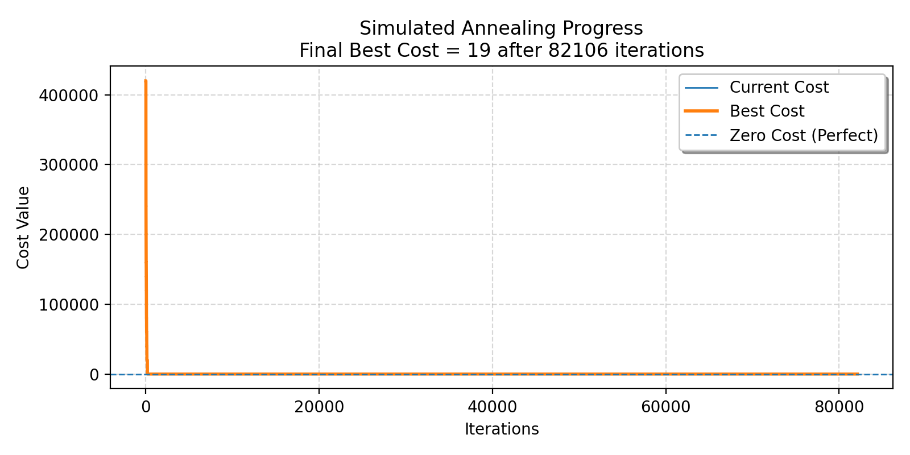

# 📚 Departmental Timetable Using Simulated Annealing


## 🔍 Project Overview

**Departmental Timetable Using Simulated Annealing** is an AI‑based optimization project designed to automatically generate an optimal **university lab timetable** while minimizing clashes and respecting faculty preferences.

Manual timetable creation is:

* Time‑consuming
* Error‑prone
* Difficult to optimize for all constraints

This project solves the problem using **Simulated Annealing (SA)** — a powerful meta‑heuristic optimization algorithm inspired by the annealing process in metallurgy.

---

## 🎯 Project Objectives

The main goals of this project are:

* ✅ Avoid **teacher clashes** (same teacher in two labs at the same time)
* ✅ Avoid **room clashes** (same lab used by multiple classes at the same time)
* ✅ Respect **faculty preferred time slots** as much as possible
* ✅ Reduce **back‑to‑back lectures** and unnecessary gaps
* ✅ Automatically generate a **professional PDF timetable**
* ✅ Provide a **GUI‑based system** for easy usage

---

## 🧠 Why Simulated Annealing?

Timetable generation is an **NP‑Hard optimization problem**, meaning:

* Brute‑force solutions are impractical
* Greedy approaches get stuck in local optima

**Simulated Annealing**:

* Accepts worse solutions early (to escape local minima)
* Gradually converges toward an optimal solution
* Works efficiently for large search spaces

---

## ⚙️ How the System Works

### 1️⃣ Input Phase

The user provides:

* 📘 **Courses**
* 👨‍🏫 **Faculty mapping** (course → teacher)
* 🏫 **Available labs/rooms**
* ⏰ **Available time slots**
* ⭐ **Preferred slots for teachers**

Inputs can be:

* Entered via GUI
* Loaded from an external file

---

### 2️⃣ Cost Function (Core Logic)

Each generated timetable is evaluated using a **cost function**.

Lower cost = better timetable

#### 🔴 Hard Constraints (High Penalty)

* Teacher assigned to two classes at same time
* Room used by multiple classes at same time
* Missing teacher mapping

#### 🟡 Soft Constraints (Low Penalty)

* Non‑preferred time slots
* Back‑to‑back lectures
* Large gaps in schedule
* Too many sessions in one day

```text
Final Cost = Σ (All Penalties)
Perfect Timetable → Cost = 0
```

---

### 3️⃣ Simulated Annealing Process

1. Generate a **random initial timetable**
2. Slightly modify it to create a **neighbor solution**
3. Accept or reject the new solution based on:

   * Cost difference
   * Temperature value
4. Gradually **cool down** the temperature
5. Track:

   * Current cost
   * Best cost

This continues until:

* Maximum iterations are reached OR
* Cost becomes zero

<p align="center">
  
</p>
---

### 4️⃣ Visualization

The algorithm generates a progress graph showing:

* 🔵 Current Cost
* 🟠 Best Cost
* 🟢 Zero Cost (Perfect Solution)

This helps analyze convergence behavior.

---

### 5️⃣ Output Generation

✔ Optimized timetable displayed in GUI
✔ Automatically exported as **PDF**
✔ Includes:

* Course
* Teacher
* Room
* Time slot

---

## 🖥️ Technologies Used

| Technology          | Purpose                |
| ------------------- | ---------------------- |
| Python              | Core programming       |
| Tkinter             | GUI development        |
| Simulated Annealing | Optimization algorithm |
| Matplotlib          | Graph plotting         |
| ReportLab           | PDF generation         |

---

## 📂 Project Structure

```bash
Departmental-Timetable-Using-Simulated-Annealing/
│
├── main.py                # Main application
├── sa_progress.png        # SA convergence graph
├── Lab_timetable.pdf      # Generated timetable
├── README.md              # Project documentation
```

---

## 🚀 Key Features

* 🎯 AI‑based optimization
* 🧩 Handles real‑world constraints
* 📊 Live & static visualization
* 🖱️ User‑friendly GUI
* 📄 Automatic PDF export
* ⚡ Optimized for performance

---

## 📈 Sample Result

* Initial random cost: **Very High**
* Final optimized cost: **19**
* Iterations: **82,106**

This demonstrates strong convergence toward an optimal timetable.

---

## 👨‍💻 Author

**Ali Raza**
Department of Computer Science
AI / Optimization Enthusiast

---

## 📜 License

This project is for **educational and academic use**.
You are free to modify and enhance it with proper credit.

---

⭐ *If you like this project, don’t forget to give it a star on GitHub!* ⭐
